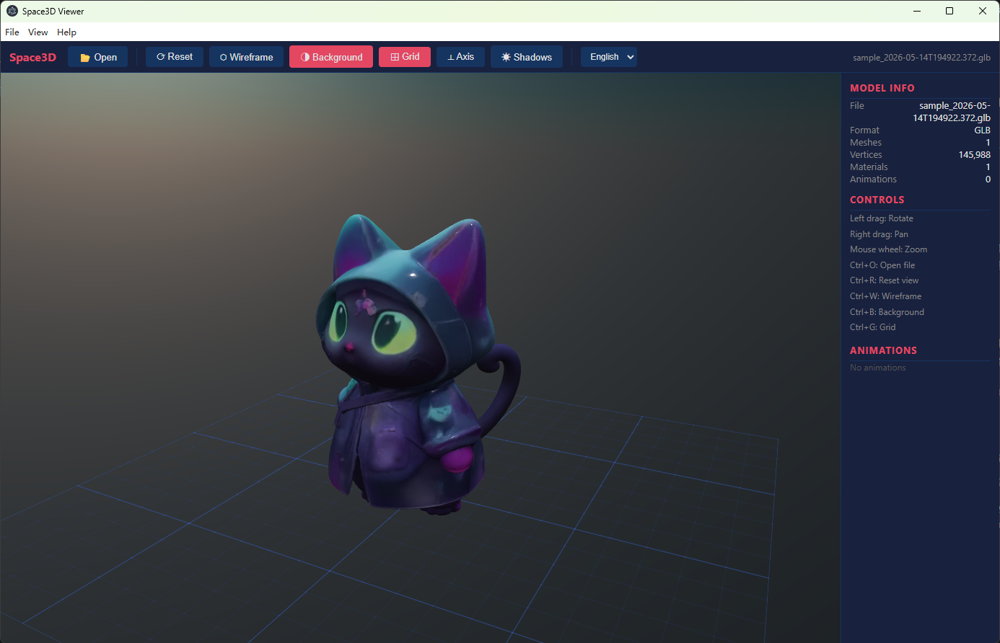

# Space3D Viewer

Space3D Viewer 是一个本地离线运行的桌面 3D 模型查看器，基于 Electron、BabylonJS、Vite 和 Three.js 构建。

English README: [README.md](README.md)

## 界面截图



## 功能
- 离线查看本地 3D 模型
- 支持格式：`glb`、`gltf`、`obj`、`fbx`、`stl`
- 支持拖拽加载模型
- 相机操作：旋转、平移、缩放、重置
- 显示开关：线框、天空背景、网格、坐标轴、阴影
- 坐标轴系统：
	- 角落世界坐标 gizmo（始终可见，不被模型遮挡）
	- 模型中心本地坐标轴
- 模型统计信息与动画控制
- 支持打包为 Windows EXE 安装程序
- 支持中英文界面切换（默认英文）
- 支持文件后缀关联（双击或右键打开）

## 技术栈
- Electron：桌面程序外壳
- BabylonJS：渲染与大部分模型加载
- Three.js：用于 FBXLoader，补足 FBX 支持
- Vite：渲染器构建工具
- electron-builder：Windows 打包工具

## 项目结构
- `main.js`：Electron 主进程（窗口、菜单、对话框、语言、文件打开联动）
- `preload.js`：安全 IPC 桥接层
- `renderer/index.html`：渲染器 UI 入口
- `src/viewer.js`：查看器核心逻辑（场景、加载器、i18n、gizmo）
- `vite.config.js`：渲染器构建配置（`renderer/` -> `app/`）
- `package.json`：脚本、依赖、electron-builder 配置
- `agent_doc/overview.md`：内部架构与开发说明

## 开发运行
先安装依赖：

```bash
npm install
```

构建渲染器：

```bash
npm run build:renderer
```

启动桌面程序：

```bash
npm start
```

快捷开发命令（构建并运行）：

```bash
npm run dev
```

## 打包 Windows EXE
生成 Windows 安装包：

```bash
npm run build
```

输出会在 `dist/` 目录中。

## 语言切换
- 默认语言是 **English**。
- 可在以下位置切换：
	- 工具栏语言下拉框
	- 菜单 `View -> Language`

## 文件关联
安装包会注册这些后缀：`.glb`、`.gltf`、`.obj`、`.fbx`、`.stl`。

安装后可以通过以下方式直接打开模型：
- 双击模型文件
- 右键“打开方式”选择 Space3D Viewer

## 说明
- 程序安装后可离线运行。
- 已放开本地 `file:` 和 `blob:` 资源访问，避免模型贴图加载失败。
- FBX 通过 Three.js 的 FBXLoader 处理，因为当前方案下 BabylonJS 没有原生 FBX 加载器。
